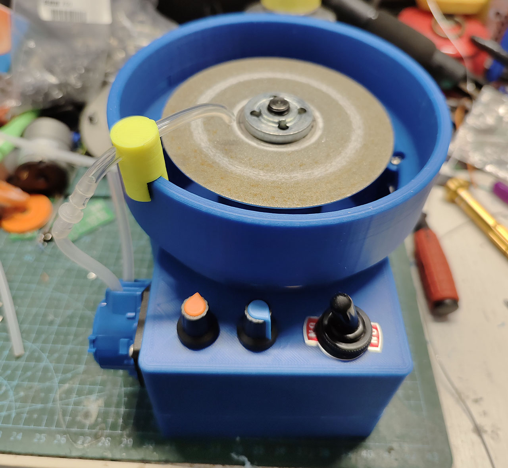
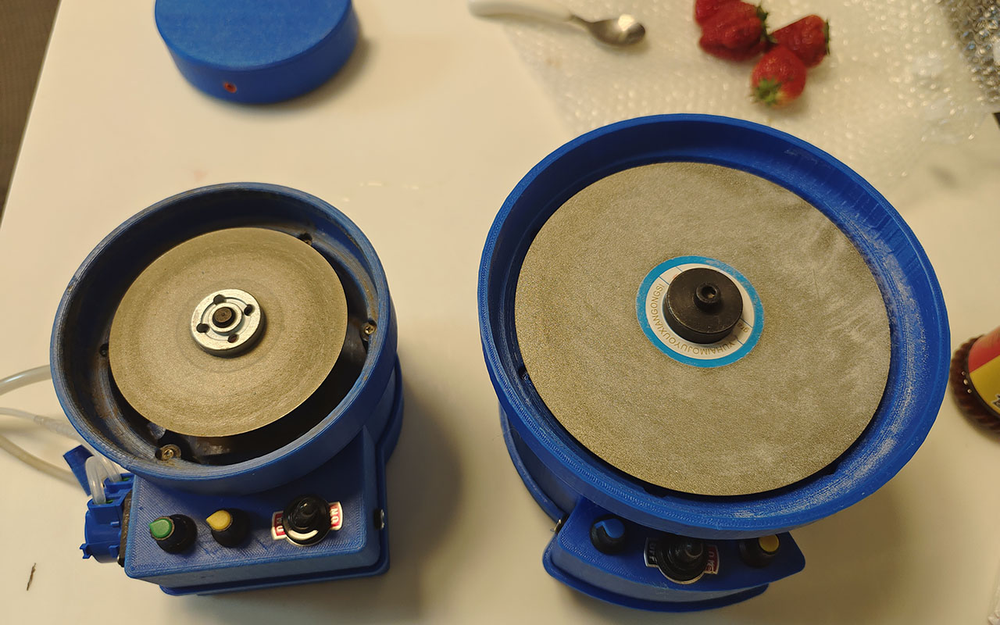

# 4寸水磨机

### 介绍
一款可以滴水打磨玉石，雕刻刀的水磨机。一般干磨的机器会有很大的灰尘，加入水磨一个可以进行水冷，二来可以将灰尘带入水中，可以进行有效的保持桌面的干净。机器支持4寸金刚石磨片，还有其他角磨机配件。平时打磨 石头，木头，3d打印件，很实用。  
机器支持正反转，无极调速。  
开源4寸水磨机，基于887，775电机，角磨机轴套，无极调速，蠕动泵。

### 视频演示
 

### 打磨效果

### 主轴电机
887电机尺寸如下图所示  

### 电路部分

其他资料稍后完善。。。