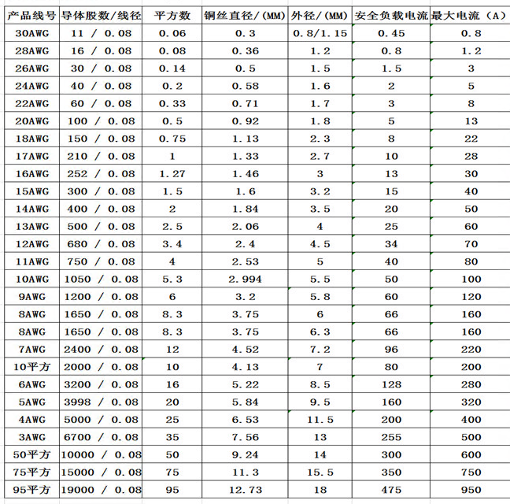
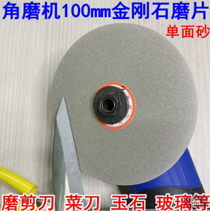
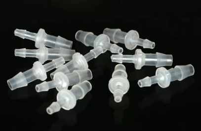
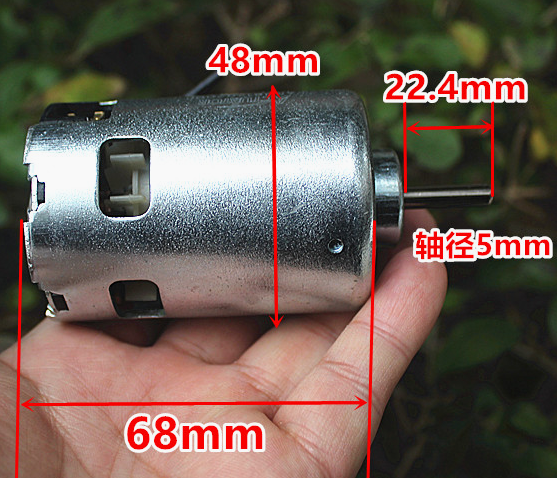
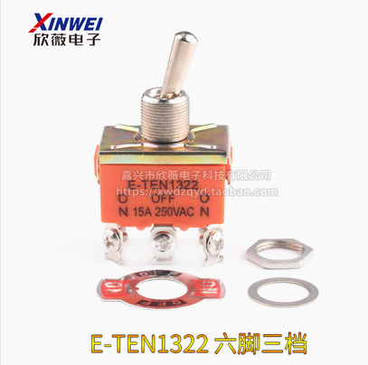
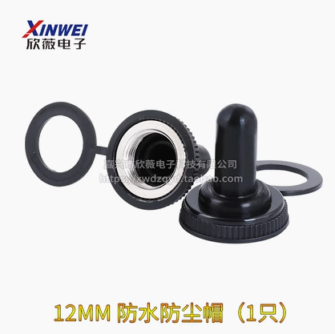
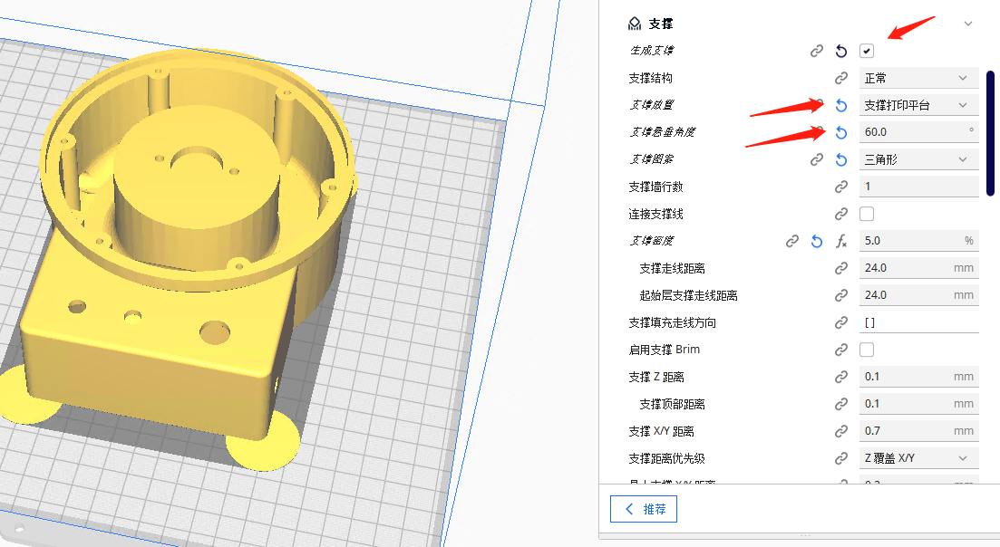

# 4寸水磨机
### 链接地址
<!-- ***[🚩个人主页](http://diy.flywt.cn)***   -->
[🍎GitHub](https://github.com/xvipservice/4-inch-water-mill)  
[🍏立创开源硬件平台](https://oshwhub.com/xvipservice/shui-mo-ji_copy)

### 介绍
一款可以滴水打磨玉石，雕刻刀的水磨机。一般干磨的机器会有很大的灰尘，加入水磨一个可以进行水冷，二来可以将灰尘带入水中，可以进行有效的保持桌面的干净。机器支持4寸金刚石磨片，还有其他角磨机配件。平时打磨 石头，木头，3d打印件，很实用。  
机器支持正反转，无极调速。  
开源4寸水磨机，基于887，775电机，角磨机轴套，无极调速，蠕动泵。
  

### 视频演示
 
### 打磨效果

### 主轴电机
887电机尺寸如下图所示  

### 电路部分

### 配件信息
 名称 | 备注 |描述
:---|:---|:---
 M3*25自攻螺丝|若干|
 M5*14内六角|2颗
 4*6mm | 透明软管
 6*8mm | 透明软管
 12v10A或者24v10A也可以|开关电源
 线材若干||由于功率较大，电机线，电源线劲量粗些，最少能够支持10A电流
 4寸金刚石磨盘||中间孔16mm
 直径4mm塑料直通 |
 东成100A压板||S1M-FF03-100A
 大功率887电机||轴最少20mm长|
 M10-5MM连接杆套装|
 304不锈钢宝塔接头|
 蠕动泵|
 E-TEN1322 6脚3档开关|
 12mm防水帽|

### 3D打印切片设置
部件 | 支撑| 设置
:---|:---|:---
主体|需要|
顶盖|需要
底座|无需支撑  
防水环|无需支撑  

其他资料稍后完善。。。  
